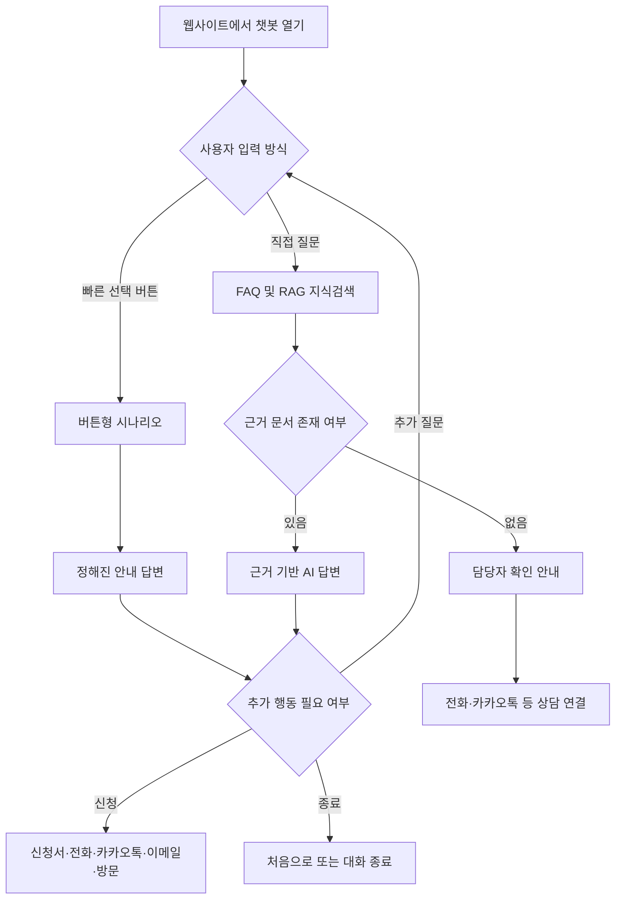

# 이대목동병원 편의지원 챗봇 현행 구조 및 사용자 시나리오

- 문서 목적: 채널톡 기반 챗봇을 자체 구축 시스템으로 전환하기 위한 개발팀 인수인계
- 작성 기준일: 2026-08-14
- 대상 서비스: 이대목동병원 장애인 의료기관 이용편의 지원사업 챗봇
- 확인 범위: 현재 폴더의 Excel, Markdown 지식문서, 이미지, 사전문진표 및 실제 동작 영상

## 1. 한눈에 보는 현재 방식

현재 챗봇은 **버튼형 사용자 시나리오와 문서 기반 AI 답변을 결합한 하이브리드 방식**이다.

1. 사용자가 웹사이트 우측의 플로팅 챗봇을 연다.
2. 자주 묻는 항목은 빠른 선택 버튼으로 안내한다.
3. 사용자가 직접 질문하면 FAQ 또는 RAG 지식문서를 근거로 AI가 답변한다.
4. 챗봇이 처리하면 안 되는 질문은 의료진, 병원 대표번호 또는 편의지원 담당자에게 연결한다.
5. 서비스 신청은 외부 신청서, 전화, 카카오톡, 이메일 또는 방문 신청으로 연결한다.

## 2. 실제 화면에서 확인된 구성

실제 동작 영상에서 다음 UI와 흐름을 확인했다.

- 웹사이트 주소: `barrierfree.eumc.ac.kr`
- 챗봇 위치: PC 화면 우측의 플로팅 패널
- 챗봇 제목: `이대목동병원 장애인 이용편의 지원사업`
- 챗봇 안내원 명칭: `편의지원 매니저`
- 첫 인사: 환자와 보호자의 병원 이용을 돕는 편의지원 매니저임을 안내
- 빠른 선택 버튼:
  - 지원 범위
  - 이용 대상
  - 신청 방법
  - 비용 안내
  - 운영 시간 & 위치
  - 질문하기
- 하위 흐름에서 `처음으로`, `질문하기` 버튼 제공
- 자유질문 화면에 `AI에게 질문해 주세요.` 입력창 제공
- 답변 안에 전화 연결 버튼과 외부 링크를 표시
- 병원 대표 정보가 포함된 링크 카드 표시

## 3. 채널톡에 투입된 자료와 역할

| 자료 | 역할 | 자체 구축 시 사용 방법 |
|---|---|---|
| `[이대목동] 장애편의_콘텐츠_랜딩페이지&챗봇_251222.xlsx` | 챗봇 기본정보, AI Instruction, 버튼형 질문, 전체 KB 원본 | 시나리오와 콘텐츠의 기준 원본으로 사용 |
| `faq_upload_template_ko-260105-.xlsx` | 채널톡 FAQ 업로드 데이터 44건 | FAQ 테이블 또는 의도별 고정답변으로 이전 |
| `챗봇 일반 kb.xlsx` | 병원 일반정보 16건과 제외 질문 | 병원 일반 KB 및 검토 대기 목록으로 이전 |
| `kb_md/00_AI_INSTRUCTION_v2.md` | AI 역할, 말투, 금지사항, Fallback | 시스템 프롬프트 및 정책 규칙으로 사용 |
| `kb_md/01~43_*.md` | 편의지원 사업 관련 지식 43건 | RAG 지식문서로 적재 |
| `kb_md/44~59_*.md` | 병원 일반 지식 16건 | RAG 지식문서로 적재 |
| `kb_md/inepector.txt` | 상세 AI 매니저 지침 | 시스템 프롬프트 보완자료로 사용 |
| `[서식] ... 사전문진표 (7).pdf` | 신청 시 참고하는 사전문진표 | 다운로드 또는 전자 신청서 구현 시 참고 |
| `logo_ehwa 채널 대표 이미지.svg` | 채널 대표 이미지 | 자체 챗봇 헤더·프로필 이미지 후보 |
| `이대목동 사이트에 챗봇상시.png` | 챗봇 실행 아이콘 | 플로팅 실행 버튼 자산 후보 |
| `실제 이대목동 챗봇 동작.mp4` | 실제 사용자 화면과 답변 흐름 | UI 및 시나리오 검증 기준 |
| `채널톡 로그인-뉴테크리모 계정.mp4` | 채널톡 관리자 접속과 통계 화면 | 관리자·운영 기능 참고 |

### 지식문서 구성

RAG용 지식문서는 총 59건이다.

| 구분 | 건수 | 주요 내용 |
|---|---:|---|
| 챗봇 기능 문의 | 1 | 챗봇의 역할과 제공 기능 |
| 편의지원사업 기본정보 | 15 | 사업 소개, 신청, 이용 대상, 운영시간, 비용 |
| 서비스 제공 범위 | 6 | 입원간병, 화장실 보조, 외부 이동, 진료 지원 등 |
| 이동·동행 지원 | 5 | 휠체어, 보행 부축, 길 안내, 검사 대기, 자세 유지 |
| 의사소통 지원 | 2 | 수어·필담, 쉬운 설명·복약 |
| 행정 지원 | 3 | 대필·대독, 보험서류, 약 대리수령 |
| 세부 운영 정책 | 3 | 지각, 전화 부재, 노쇼 |
| 주차·접근성 | 3 | 주차요금, 주차위치, 발렛 |
| 내부 시설 정보 | 5 | 휠체어, 충전기, 투석실, 식당, 장애인 화장실 |
| 병원 일반 | 16 | 예약, 진료과 위치, 응급진료, 입퇴원, 편의시설 등 |
| **합계** | **59** |  |

## 4. 질문 처리 설계

### 4.1 버튼형 시나리오

정답과 다음 행동이 명확한 질문은 버튼형 시나리오로 처리한다.

| 1차 버튼 | 응답 내용 | 다음 행동 |
|---|---|---|
| 지원 범위 | 이동·동행, 의사소통, 행정·진료 지원과 지원 불가 항목 | 처음으로 / 질문하기 |
| 이용 대상 | 등록 장애인과 우선 지원 대상 안내 | 처음으로 / 질문하기 |
| 신청 방법 | 신청 시 필요한 정보와 신청 권장 시점 안내 | 신청서 / 다른 방법으로 신청 |
| 비용 안내 | 편의지원 서비스 무료, 진료비·검사비·약값은 별도임을 안내 | 처음으로 / 질문하기 |
| 운영 시간 & 위치 | 평일 운영시간과 병원 주소·교통편 안내 | 처음으로 / 질문하기 |

`신청 방법`은 다시 다음과 같이 분기한다.

- 온라인 신청서
- 카카오톡 상담
- 전화
- 이메일
- 병원 방문

### 4.2 FAQ형 답변

표현이 다양하지만 답이 고정된 질문은 대표 질문과 유사 질문을 하나의 FAQ에 묶어 처리한다.

예시:

- 대표 질문: `오늘 당장 이용할 수 있어?`
- 유사 질문:
  - `지금 병원 가는데 바로 신청돼?`
  - `예약 안 했는데 오늘 도와줄 수 있나요?`
  - `당일 접수 받아줘?`
- 고정 답변: 당일 이용은 예약 상황에 따라 어려울 수 있으므로 방문 전 편의지원팀에 확인하도록 안내

현재 채널톡 업로드본은 `question1`부터 `question11`까지 유사 질문을 저장하고 `answer`에 하나의 대표 답변을 저장하는 구조다.

### 4.3 RAG 기반 자유질문

사용자가 버튼에 없는 질문을 직접 입력하면 다음 순서로 처리한다.

1. 질문의 주제와 의도를 파악한다.
2. 59개 Markdown 지식문서에서 관련 문서를 검색한다.
3. 검색된 문서의 `답변 가이드`를 근거로 답한다.
4. 위치·시간·비용·준비물처럼 정확성이 중요한 정보는 임의로 요약하거나 만들지 않는다.
5. 답변 뒤에 관련 후속 질문을 제안한다.
6. 적절한 근거가 없으면 담당자 연결을 안내한다.

### 4.4 답변 불가 및 Fallback

| 질문 유형 | 처리 방식 |
|---|---|
| 의료 진단·처방·의학적 상담 | AI가 진단하지 않고 담당 의료진 상담 권유 |
| 병원 민원·불만 | 사과 후 병원 대표번호 안내 |
| 보험 적용·병원비·의료 행정 규정 | 편의지원 범위를 벗어남을 알리고 원무·대표번호 안내 |
| KB에 없는 일반 문의 | 추측하지 않고 편의지원 담당자가 확인하도록 안내 |
| 개인정보가 필요한 요청 | 챗봇에서 불필요한 개인정보를 수집하지 않고 별도 신청·상담 채널로 이동 |

## 5. AI 응답 정책

### 역할

- 장애인과 고령자의 병원 이용을 돕는 디지털 편의지원 안내원
- 이동, 의사소통, 행정 절차의 어려움을 해결하고 서비스 신청을 지원
- 의료진이나 실제 편의지원 인력을 대신하는 존재가 아니라 정보 안내와 연결 역할 수행

### 말투와 형식

- 따뜻하고 친근한 해요체
- 문장은 짧고 명확하게 작성
- 설명이 길면 목록으로 구분
- KB의 마크다운 구조와 강조 표현 유지
- 사용자의 어려움에 공감하되 지원 범위를 과장하지 않음
- 답변 후 관련 정보나 다음 행동을 질문 형태로 제안

### 핵심 제한

- KB에 없는 내용을 추측하지 않는다.
- 의료 진단, 처방, 보험 적용 여부를 단정하지 않는다.
- `처음부터 끝까지 무조건 동행한다`고 약속하지 않는다.
- 사용자에게 불필요한 개인정보 입력을 요구하지 않는다.
- 위치 안내 시 휠체어 사용자는 엘리베이터 경로를 우선한다.
- 별관 이동 시 본관 2층 연결통로를 우선 안내한다.

## 6. 대표 사용자 시나리오

### 시나리오 A. 사용자가 서비스 범위를 확인하는 경우

1. 사용자가 챗봇을 연다.
2. `지원 범위` 버튼을 누른다.
3. 챗봇이 이동·동행, 의사소통, 행정·진료 지원을 설명한다.
4. 입원간병이나 병원 밖 이동 등 지원 불가 항목도 함께 안내한다.
5. `처음으로`와 `질문하기`를 제공한다.

### 시나리오 B. 사용자가 서비스를 신청하는 경우

1. 사용자가 `신청 방법`을 선택한다.
2. 챗봇이 진료 3일 전 신청 권장과 필요한 정보를 안내한다.
3. 사용자가 온라인 신청 또는 `다른 방법으로 신청`을 선택한다.
4. 다른 방법을 선택하면 카카오톡, 전화, 이메일, 병원 방문을 표시한다.
5. 전화 선택 시 전화번호와 운영시간을 보여주고 전화 연결 버튼을 제공한다.
6. 신청 완료 후 `처음으로` 또는 추가 질문으로 이동한다.

### 시나리오 C. 사용자가 병원 위치나 시설을 자유롭게 묻는 경우

1. 사용자가 `장애인 주차장은 어디인가요?`라고 입력한다.
2. 시스템이 주차 관련 KB를 검색한다.
3. 장애인 전용 주차구역, 무료 주차 기준, 주차 안내 링크를 답변한다.
4. 병원 링크 카드를 함께 보여줄 수 있다.
5. 진료과 위치나 병원 내 편의시설 정보가 더 필요한지 후속 질문한다.

### 시나리오 D. 사용자가 진료과 위치를 묻는 경우

1. 사용자가 `안과는 어디에 있나요?`라고 입력한다.
2. 진료과 위치 KB에서 층, 호수, 랜드마크를 검색한다.
3. 휠체어 또는 거동불편 여부를 파악할 수 있으면 엘리베이터 경로를 우선 안내한다.
4. 일반 사용자는 에스컬레이터 기준 경로를 안내할 수 있다.
5. 상세 층별 지도 링크를 제공한다.

### 시나리오 E. 사용자가 의료상담을 요청하는 경우

1. 사용자가 증상, 진단 또는 약 처방을 묻는다.
2. 챗봇은 의료적 판단을 생성하지 않는다.
3. AI 챗봇은 진단이 어렵다는 점을 알린다.
4. 담당 의료진과 상의하도록 안내한다.
5. 필요하면 병원 대표번호 또는 관련 공식 채널을 제공한다.

### 시나리오 F. KB에 없는 질문을 하는 경우

1. 시스템이 관련 문서를 검색하지만 충분한 근거를 찾지 못한다.
2. 답변을 지어내지 않는다.
3. 편의지원 담당자가 확인하도록 안내한다.
4. 전화 또는 카카오톡 상담 연결을 제공한다.
5. 해당 질문은 운영자 검토 목록에 기록하여 향후 KB 보완 후보로 사용한다.

## 7. 자체 구축 시스템에 필요한 기능

### 사용자 화면

- 웹사이트 우측 하단 플로팅 실행 버튼
- 모바일·PC 반응형 채팅 패널
- 빠른 선택 버튼과 하위 선택 버튼
- 자유질문 입력창
- 외부 링크, 전화 연결, 파일 다운로드 버튼
- 처음으로, 이전 단계, 질문하기 기능
- 대화 중 로딩·오류·상담 연결 상태 표시

### 대화 엔진

- 버튼형 시나리오 상태 관리
- FAQ 유사 질문 매칭
- RAG 문서 검색과 근거 기반 답변 생성
- 의료·민원·비용·개인정보 관련 정책 분류
- 근거 부족 시 Fallback 처리
- 대화 문맥 유지와 처음으로 초기화

### 지식베이스

- Markdown 또는 관리자 입력을 통한 문서 등록
- 카테고리·세부 주제·예상 질문·답변 가이드 관리
- 문서 버전, 수정일, 담당자 기록
- 검색 인덱스 재생성
- 게시·비게시 상태 관리
- 변경 전후 이력과 롤백

### 관리자 기능

- 버튼 시나리오 문구와 순서 수정
- FAQ 추가·수정·삭제·게시
- RAG 문서 업로드와 교체
- 답변 실패·Fallback 질문 확인
- 상담량, 질문 주제, 링크 클릭 등 이용 통계
- 운영자 권한과 변경 이력 관리

### 로그와 품질관리

- 사용자 질문, 선택한 버튼, 사용한 KB 문서, 최종 답변 기록
- 개인정보 최소 수집과 로그 마스킹
- 답변 근거 문서 ID 기록
- 답변 실패율과 담당자 연결률 집계
- 운영자가 오답을 표시하고 수정할 수 있는 검수 흐름

### 접근성

- 키보드만으로 모든 버튼과 입력창 사용 가능
- 스크린리더용 이름과 상태 제공
- 충분한 색상 대비
- 200% 확대에서도 내용이 잘리거나 겹치지 않음
- 버튼의 충분한 터치 영역 확보
- 포커스 위치와 읽기 순서를 명확하게 유지

## 8. 권장 최소 데이터 구조

| 데이터 | 주요 필드 예시 |
|---|---|
| 시나리오 노드 | ID, 노드명, 안내문, 상위 노드, 노드 유형, 게시 상태 |
| 선택 버튼 | ID, 노드 ID, 버튼명, 정렬 순서, 이동 노드 또는 실행 액션 |
| FAQ | ID, 대표 질문, 유사 질문 목록, 답변, 카테고리, 게시 상태 |
| 지식문서 | ID, 제목, 카테고리, 본문, 버전, 수정일, 게시 상태 |
| 외부 액션 | ID, 유형, 표시명, URL 또는 전화번호, 활성 상태 |
| 정책 규칙 | ID, 분류명, 감지 조건, 고정 안내문, 연결 대상 |
| 대화 로그 | 대화 ID, 시각, 사용자 입력, 처리 유형, 근거 문서, 답변, 결과 |

## 9. 운영 콘텐츠 수정 흐름

1. 운영자가 신규 질문 또는 오답 로그를 확인한다.
2. 기존 FAQ나 KB로 처리 가능한지 판단한다.
3. 기존 자료를 수정하거나 신규 문서를 등록한다.
4. 검수자가 전화번호, 운영시간, 링크, 의료 관련 표현을 확인한다.
5. 승인된 자료만 게시한다.
6. RAG 검색 인덱스를 갱신한다.
7. 대표 질문으로 답변을 재시험한다.
8. 문제 발생 시 이전 버전으로 되돌린다.

## 10. 현재 자료에서 확인되지 않거나 재확인이 필요한 항목

### 채널톡 설정 내보내기 부재

현재 폴더에는 다음 자료가 없다.

- 채널톡 워크플로 전체 내보내기 파일
- 웹사이트 위젯 삽입 스크립트
- AI 모델 및 세부 옵션
- RAG 문서 분할 크기, 검색 개수, 유사도 기준
- 시스템 프롬프트가 실제 채널톡 어느 설정에 적용됐는지에 대한 캡처
- 상담원 자동 배정과 알림 규칙
- 운영 통계 원본 데이터

따라서 자체 구축 시 세부 기술값은 새 시스템 기준으로 결정하고 검증해야 한다.

### 공식 연락처

- 편의지원팀 공식 전화번호: `02-2650-5586`

자체 구축 시 버튼형 시나리오, AI 답변, 전화 연결 버튼과 관리자 설정에서 이 번호를 동일하게 사용한다.

### 신청서 연동

- 신청서는 Walla 외부 폼을 사용한다.
- 운영 신청서 URL: `https://walla.my/a/barrierfree_v`

자체 구축 시 신청서 URL을 소스코드에 직접 입력하지 않고 관리자 설정 또는 환경설정에서 변경할 수 있도록 관리한다.

### 검토 대기 질문

기존 Excel에서 다음 질문은 제외 또는 확인 필요로 관리되고 있다.

- 장애인 콜택시 하차 위치
- 발작 후 안정 공간
- 안내견 출입
- 장루 세척이 가능한 장애인 화장실

공식 답변을 확보하기 전에는 AI가 임의로 답하지 않도록 해야 한다.

## 11. 개발 완료 확인 체크리스트

- [ ] 첫 화면에서 빠른 선택 버튼 6개가 정상 노출된다.
- [ ] 모든 버튼 흐름에서 처음으로 또는 질문하기로 이동할 수 있다.
- [ ] 신청 방법이 신청서·카카오톡·전화·이메일·방문으로 연결된다.
- [ ] FAQ 대표 질문과 유사 질문이 동일한 답변으로 연결된다.
- [ ] 59개 지식문서가 검색 대상에 포함된다.
- [ ] 답변과 함께 사용한 근거 문서가 로그에 기록된다.
- [ ] KB에 없는 내용은 생성하지 않고 담당자 연결로 전환된다.
- [ ] 의료 진단·보험·병원비 질문에 정책 답변이 적용된다.
- [ ] 공식 전화번호 `02-2650-5586`과 Walla 신청 URL이 모든 시나리오와 설정에 동일하게 반영되어 있다.
- [ ] 키보드와 스크린리더로 주요 흐름을 이용할 수 있다.
- [ ] 모바일과 PC에서 채팅창이 화면 밖으로 잘리지 않는다.
- [ ] 관리자가 FAQ와 지식문서를 수정하고 게시할 수 있다.
- [ ] 오답·Fallback·상담 연결 통계를 확인할 수 있다.

## 12. 참고자료

- [챗봇 기획 및 전체 KB Excel](<./[이대목동] 장애편의_콘텐츠_랜딩페이지&챗봇_251222.xlsx>)
- [채널톡 FAQ 업로드본](<./faq_upload_template_ko-260105-.xlsx>)
- [병원 일반 KB](<./챗봇 일반 kb.xlsx>)
- [AI Instruction](<./kb_md/00_AI_INSTRUCTION_v2.md>)
- [상세 AI 매니저 지침](<./kb_md/inepector.txt>)
- [챗봇 기능 구축 설명](<./kb_md/5. 챗봇 기능 구축.txt>)
- [사전문진표 PDF](<./[서식] 이대목동병원 장애편의지원서비스 사전문진표 (7).pdf>)
- [실제 챗봇 동작 영상](<./사용방법과 실제 챗봇 동영상/실제 이대목동 챗봇 동작.mp4>)
- [채널톡 관리자 로그인 및 화면 영상](<./사용방법과 실제 챗봇 동영상/채널톡 로그인-뉴테크리모 계정.mp4>)
